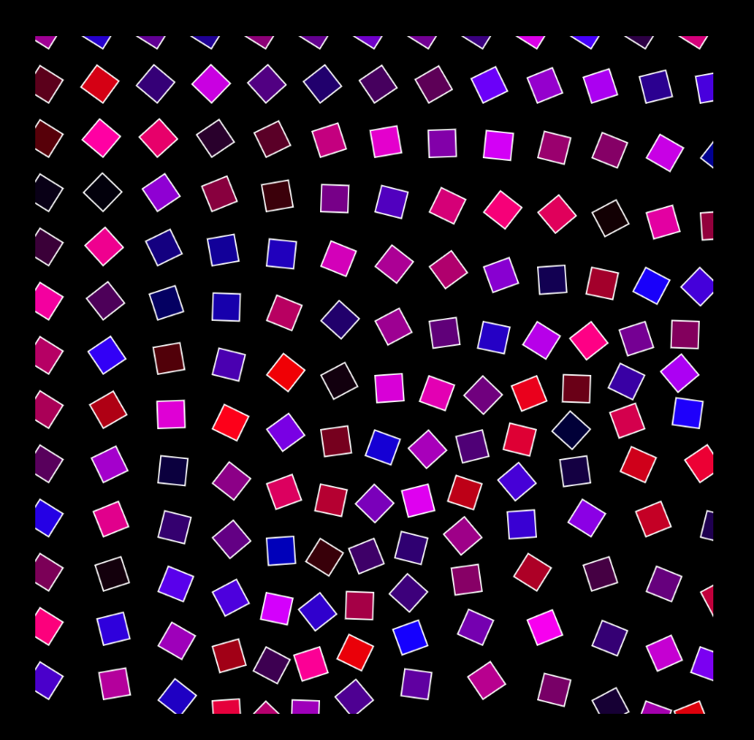
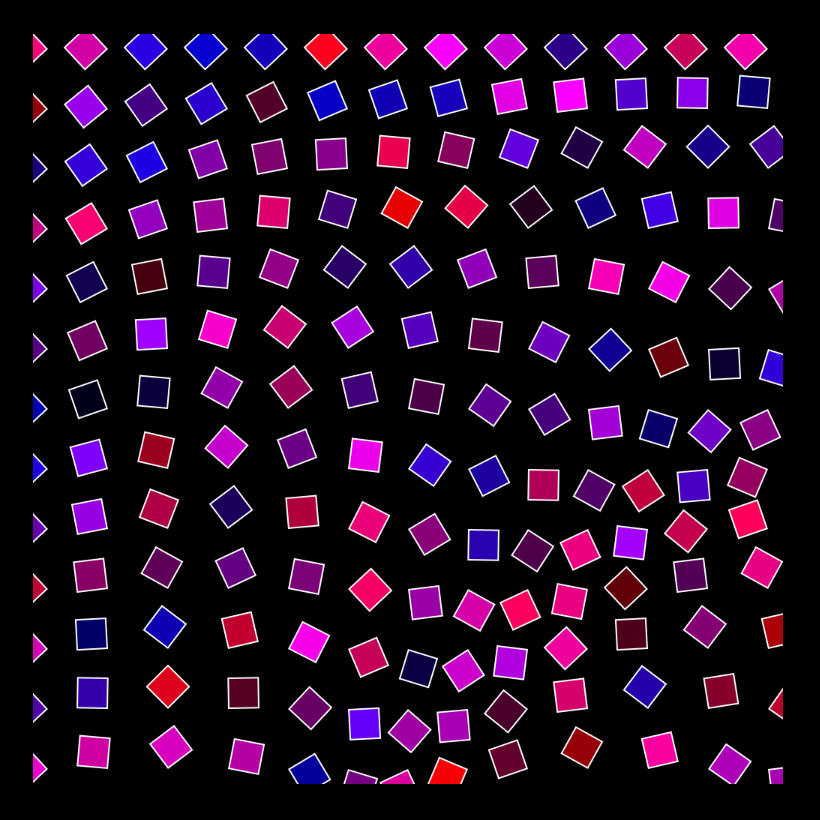
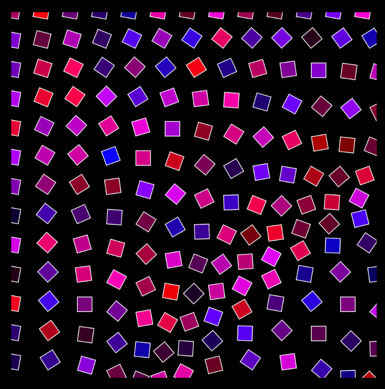
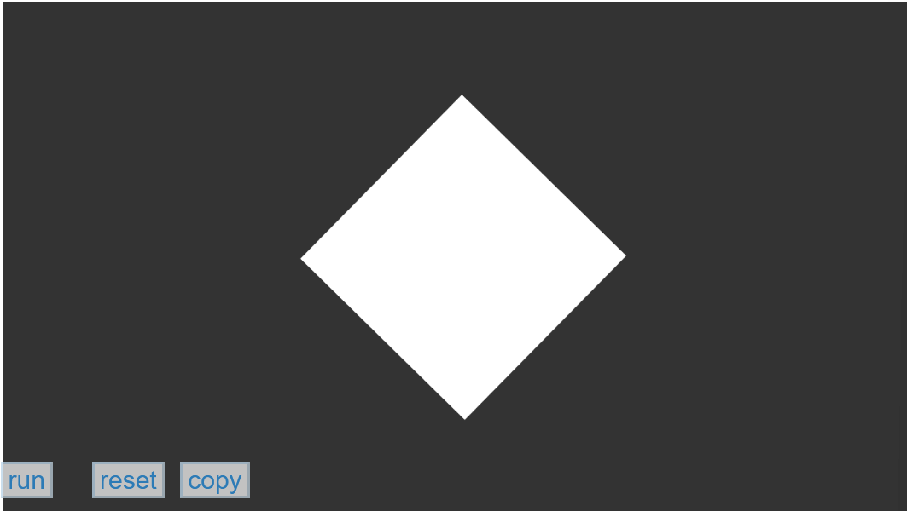

# jyua9951_9103_tut1

# Part 1: Imaging Technique Inspiration
- Description:

The imaging technique I found could be identified as the "User Input" method. When you move your mouse around the screen, the rectangles on the canvas rotate in the same direction to create a dynamic wavy look, and the color of each rectangle is blinking all the time to emphasize the artistic look. I think this technique is beneficial because I can incorporate this with the image we choose to make certain part has some interactions when people move the cursor on the image. The animation of the rotating moving parts will make the artwork look more interesting and engaging. 

- Images of examples:

## Part 2: Coding Techinique Exploration
- Description:

The example provided in p5.js clearly shows how the Rotate technique works. From the codes, I can see how to set up jitter and angle values to the rotation, and for different time periods, the rectangle rotates in different directions because of the two different values. I can apply the same technique to different shapes on the chosen image to make different parts have different rotating directions or angles. 

- Image of the coding technique in action:

- Link to an example and code:

[https://p5js.org/examples/transform-rotate.html](https://p5js.org/examples/transform-rotate.html)